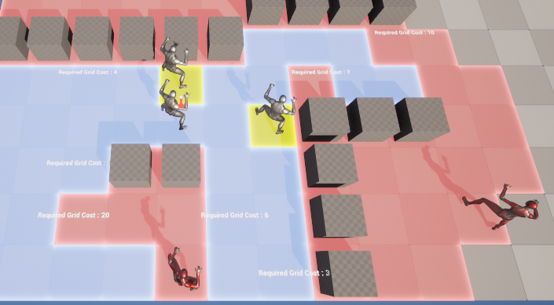

## 목차

1. [PathFindingSystem](#pathfindingsystem)
2. [GridVisual](#gridvisual)

# PathFindingSystem

이 맵은 FGrid라는 구조체로 X,Y의 정보와 언리얼 엔진 월드의 좌표를 매칭하여 GridSystem을 만들었다.  
GameMode가 Grid 정보와 PathFinding 계산을 담당한다.  
F = G+H라는 A* 알고리즘에 의거하여, F가 최소가 되는 지점을 탐색해 길을 찾아 도착지까지의 거리를 계산한다.  
도착지의 거리를 계산해야하는 이유는, 예를 들면, 이동거리가 5인 상태의 유닛이 그리드만 봤을 때는 충분히 이동할 수 있지만, 위의 이미지처럼 적이 막고 있거나, 장애물이 존재하면 우회해야하므로 거리가 증가한다. 그런 계산을 통해 초록색 그리드는 이동이 가능한 지점, 빨간색은 이동이 불가능한 지점을 나타낸다.  
노란색은 아군이다.  

# GridCostModifier

GridCostModifier라는 Actor를 이동에 필요한 Cost를 변경할 위치에 배치하면 해당 위치의 Grid의 Cost가 바뀐다.
길찾기 알고리즘에서 Cost를 계산해서 지나갈 수 있는지, 아니면 다른 길로 우회해서 해당 위치를 갈 수 있는지 확인하여 유닛이 도착할 수 있는 위치를 계산해준다.

# GridVisual

그리드 칸의 색상이 보이는 것은 UInstancedStaticMeshComponent를 통해 구현했다.
각 칸의 그리드에 그리드 Actor를 설치하고 각각이 StaticMesh를 가진 것보다 FPS는 높게 나온다.

# UnitAction

UnitAction이라는 기본 액션을 만든 뒤에, 필요한 액션을 구현한 뒤에 유닛에게 부여하면 된다.

예시로, 선택된 유닛이 현재 행동 가능한 액션이 무엇인지 보여주고, 이를 유저가 선택하여 원하는 행동을 할 수 있게 한다.

공격 액션을 예시로 들면, 사거리 내에 공격 가능한 유닛을 선택하면, 내 유닛과 적 유닛의 스탯을 계산하여 공격의 결과를 알려줄 것이다. 그리고 공격을 최종적으로 수락하면 해당 유닛끼리 공격하고 맞는 애니메이션과 함께 결과처럼 HP가 깎이고, HP가 0이 된 유닛은 죽는다.

