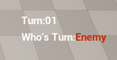

## 목차

1. [PathFindingSystem](#pathfindingsystem)
2. [GridVisual](#gridvisual)

# PathFindingSystem


이 맵은 FGrid라는 구조체로 X,Y의 정보와 언리얼 엔진 월드의 좌표를 매칭하여 GridSystem을 만들었다.  
GameMode가 Grid 정보와 PathFinding 계산을 담당한다.  
F = G+H라는 A* 알고리즘에 의거하여, F가 최소가 되는 지점을 탐색해 길을 찾아 도착지까지의 거리를 계산한다.  
도착지의 거리를 계산해야하는 이유는, 예를 들면, 이동거리가 5인 상태의 유닛이 그리드만 봤을 때는 충분히 이동할 수 있지만, 위의 이미지처럼 적이 막고 있거나, 장애물이 존재하면 우회해야하므로 거리가 증가한다. 그런 계산을 통해 초록색 그리드는 이동이 가능한 지점, 빨간색은 이동이 불가능한 지점을 나타낸다.  
노란색은 아군이다.  

# GridCostModifier


위 : Modifier 적용 전  
아래 : Modifier 적용 후  

GridCostModifier라는 Actor를 이동에 필요한 Cost를 변경할 위치에 배치하고 원하는 Cost를 CostModifier의 프로퍼티 Cost를 변경하면 해당 위치의 Grid의 Cost가 입력된 값으로 바뀐다.  
길찾기 알고리즘에서 Cost를 계산해서 지나갈 수 있는지, 아니면 다른 길로 우회해서 해당 위치를 갈 수 있는지 확인하여 유닛이 도착할 수 있는 위치를 계산해준다.

# UnitAction


UnitAction이라는 기본 액션을 만든 뒤에, 필요한 액션을 구현한 뒤에 유닛에게 부여하면 된다.


예시로, 선택된 유닛이 현재 행동 가능한 액션이 무엇인지 유저는 확인할 수 있으며, 유저가 원하는 Action을 선택하여 유닛이 원하는 행동을 할 수 있게 한다.


공격 액션을 예시로 들면, 사거리 내에 공격 가능한 유닛을 플레이어가 선택하면, 내 유닛과 적 유닛의 스탯을 계산하여 공격의 결과를 알려줄 것이다.  
Attack 버튼을 눌러 공격을 수락하면 해당 유닛끼리 공격하고 맞는 애니메이션과 함께 결과처럼 HP가 깎이고, HP가 0이 된 유닛은 죽는다.

# Manager

## GridManager


Level의 WorldPosition을 FGrid로 구성하여 GridObject, PathFinding을 위한 PathObject를 보유하는 GridSystem, PathFindingSystem을 보유한 관리 객체다.   
이 GridManager는 자신의 위치를 시작으로 Grid를 배치하기 때문에 원하는 시작 위치에 Grid를 배치해주어야 한다.  
X,Y -> FVector / FVector -> X,Y 값으로 변경하는 기능으로 손쉽게 Grid 정보를 다룰 수 있다.
아래의 GridVisualComponent를 통해 Grid의 정보를 시각적으로 표현할 수 있다.

### GridVisualComponent


그리드 칸의 색상이 보이는 것은 UInstancedStaticMeshComponent를 통해 구현했다.  
각 칸의 그리드에 그리드 Actor를 설치하고 각각이 StaticMesh를 가진 것보다 FPS는 높게 나오는 것을 확인했다.  
이미지의 예시에선, 유닛이 Move 행동을 할 때, 파란색은 이동 가능한 칸, 빨간색은 장애물이나 적 유닛이 있으므로 이동이 불가능한 칸, 노란색은 아군이 존재하여 해당 위치는 이동할 수 없지만 통과는 가능한 칸.. 등의 표현이 가능하다는 것을 보여준다.

# BattleManager


자신의 유닛과 적 유닛의 스탯에 따라 전투 결과 등을 계산해주고, 공격 수락시 전투 결과대로 공격을 실행시켜주는 관리 객체다.  

유닛의 AnimInstance를 통해 1회의 공격이 완료되었는지 확인을 한다.  
예를 들면, 내 유닛이 주먹으로 쳤을 시에 공격 애니메이션이 재생됐을 때, 주먹이 상대에게 닿았을 때 쯤에 AttackHit이라는 Notify가 동작하며, 상대 유닛은 그 AttackHit에 맞춰서 공격을 맞은 애니메이션이 재생된다.  
내 유닛이 공격 애니메이션이 거의 끝났을 쯤엔 AttackEnd라는 Notify가, 적 유닛이 공격을 맞고 애니메이션이 거의 끝났을 쯤엔 HitEnd라는 Notify가 동작하면서 BattleManager는 둘의 동작이 끝났을 것을 확인할 수 있다.  
그렇게 두 유닛의 애니메이션이 끝나고나서, 다음 공격 순서대로 애니메이션을 재생하여 계산된 결과에 맞춰 공격을 할 수 있는 것이다.
물론 공격 계산 결과대로 100% 데미지를 받는 것은 절대 아니며, 회피 확률에 따라 공격을 무시하는 회피 애니메이션이 재생되어 데미지를 받지도 않을 수도 있다.
만약 둘 중 어떤 유닛이 공격 순서대로 전투 결과를 재생하는 중에 HP가 0이 되어 죽게된다면, 이후 전투 결과는 재생되지 않고 전투가 끝날 것이다. 죽은 유닛에게는 죽고나서 사라지는 유예기간을 잠시 가지며, 유예기간이 끝나 죽는다면 GridManager에서 죽은 유닛이 점유하고 있는 Grid에서 벗어나고, 죽은 유닛이 사라지면서 플레이어가 그 후 행동을 할 수 있게 된다.

# TurnManager




플레이어의 턴인지, 적의 턴인지 확인해주는 관리 객체다.  
플레이어는 자신의 턴일 때만 유닛을 조종할 수 있다.  
플레이어가 조종할 수 있는 모든 유닛이 행동을 마쳤다면 자동으로 적에게 턴이 넘어간다.  


적 플레이어는 비헤이비어 트리를 통해 행동 상태를 구현했으며, 플레이어와 마찬가지로 유닛을 하나하나 행동에 맞게 동작시켜준다.  

```
1. 적 턴인지 확인. 플레이어의 턴이면 계속 기다림.
2. 적의 턴이 됐다면, 적 플레이어가 조종할 수 있는 유닛이 존재하는지 확인. 존재하지 않으면 NextTurn.
3. 적 유닛을 조종할 수 있다면, 먼저 유닛을 찾는다.
4. 유닛을 찾은 다음에 Move, Attack, Wait 순으로 행동을 하도록 명령한다.
5. 적 유닛이 가능한 행동이 없다면 찾은 유닛 대신할 행동 가능한 다음 유닛을 찾도록 한다.
6. 모든 유닛이 다 행동했다면 2번대로 NextTurn이 될 것이다.
```

적도 조종할 수 있는 모든 유닛이 행동을 마친다면 자신의 턴을 끝내고, 턴 숫자를 1 증가시키면서 플레이어 턴으로 바뀐다.

# Game Win Lose


유닛이 행동을 할 때마다 GameMode는 유닛의 수를 파악한다.  
유닛이 행동을 마치면 OnActionEnd라는 Delegate를 Broadcast하면 GameMode의 CheckWinOrLose를 Call된다.  


예를 들면, 플레이어 유닛이 적을 공격하는 Attack 액션을 취했다. 만약 이 유닛의 공격으로 인해 적 유닛이 죽었다면 OnActionEnd를 통해 GameMode가 현재 유닛 숫자를 파악할 것이다. 만약 적 유닛의 숫자가 0이 됐다면 이 게임은 플레이어가 승리하여 Win 상태가 된다.
다른 예시로, 적 유닛이 내 유닛을 공격할 때, 적 유닛이 죽는다면 적 유닛의 행동에 대한 OnActionEnd가 동작하여 GameMode가 유닛의 숫자를 파악한다. 이때도 적 유닛 숫자가 0이 된 상태라면 플레이어가 승리한다.
반대로, 플레이어 유닛의 숫자가 0이 됐다면 적이 승리하여 Lose 상태가 된다.